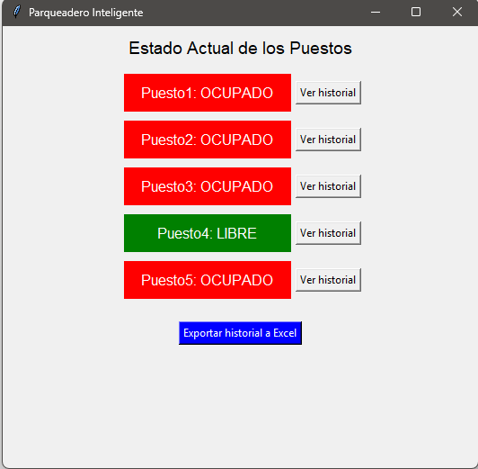
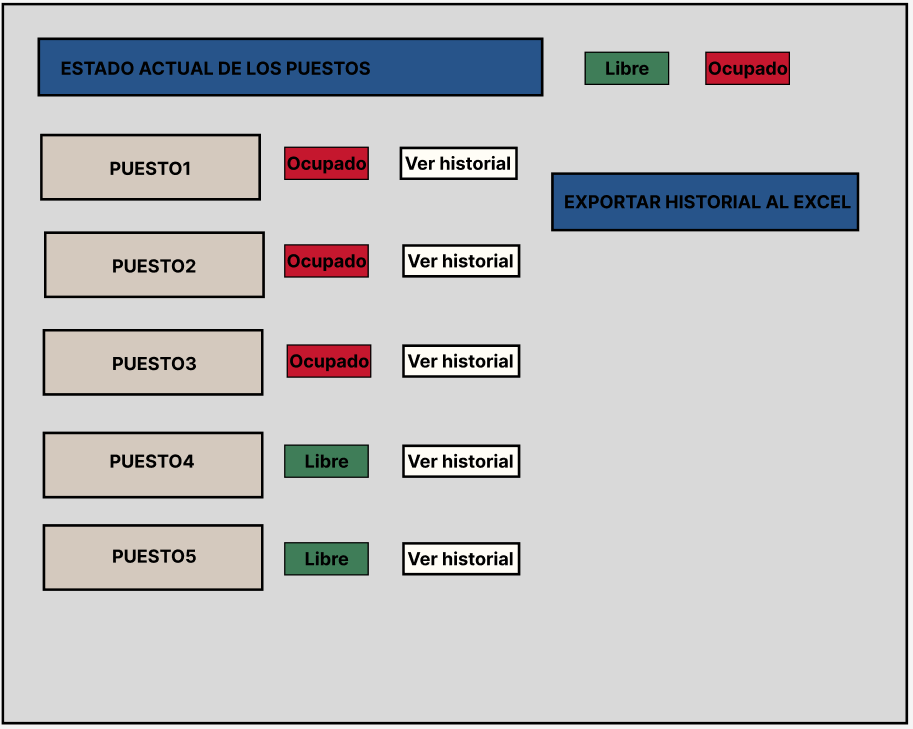
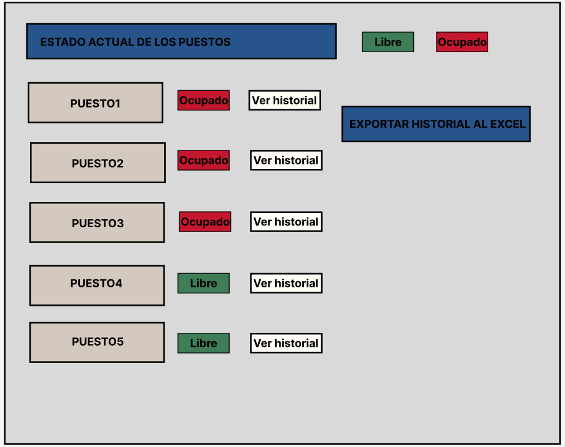

# ATM – Retiro con Autómata Finito (Python + HTML/CSS/JS)

Estados = monto restante. δ(q,b) = q − b (si q ≥ b).  
Alfabeto = {10,20,50,100}. Límite de retiro: $500.

## Requisitos
- Python 3.13.9
- pip
- jinja extension 


## Instalación
```bash
cd atm-automata
pip install -r requirements.txt

## Evidencias (capturas)
## Evidencias (capturas)

### Azure Static Web Apps (Plan Free)


### GitHub Actions (deploy exitoso)


### SecurityHeaders (A)

